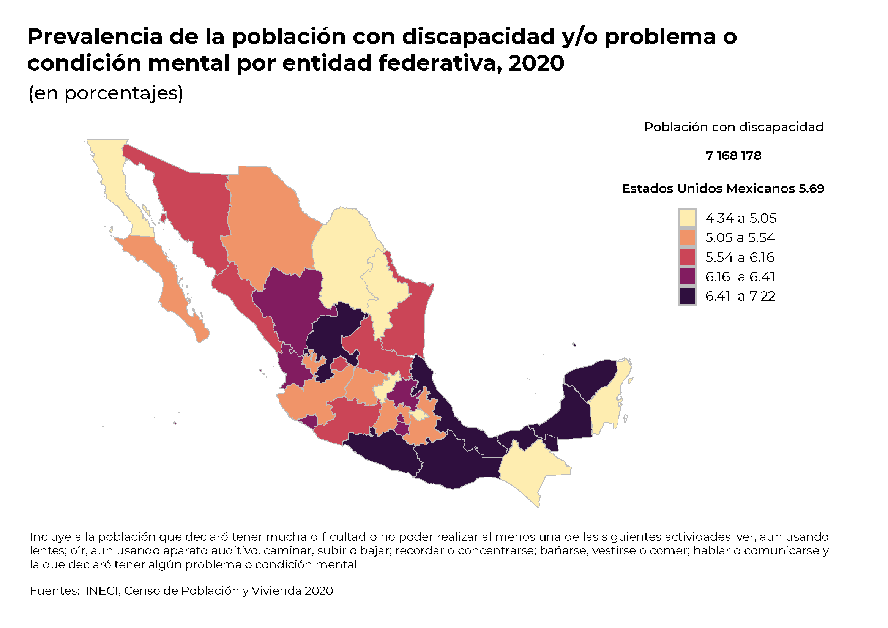
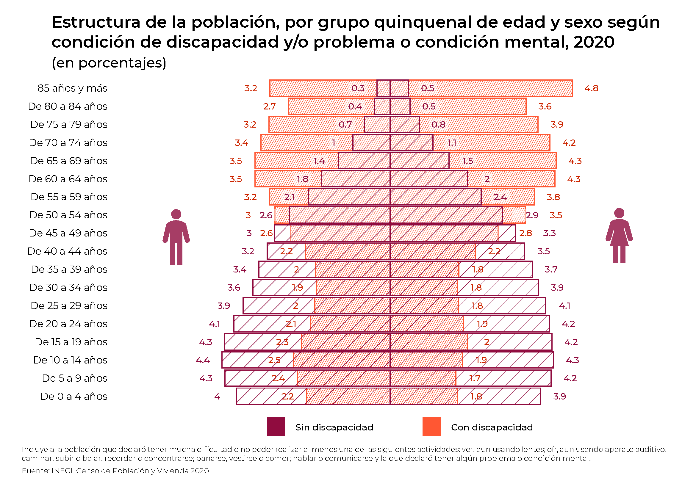

```{=html}
<style type="text/css">
body {
text-align: justify;
font-style: normal;
font-family: "Montserrat";
font-size: 12px
}
h1.title {
  font-size: 40px;
  color: #000D3B;
}
h1 {
  color: #B6854D;
}
h2 {
  color: #172984;
}
h3 {
  color: #172984;
}
</style>
```

```{=html}
<style>
.nav>li>a {
    position: relative;
    display: block;
    padding: 10px 15px;
    color: #1C3BA4
}
.nav-pills>li.active>a, .nav-pills>li.active>a:hover, .nav-pills>li>a:focus {
    color: #ffffff;
    background-color: #09C2BC
}
</style>
```

```{=html}
<style>
.tile1-text {
    position: relative;
    display: block;
    padding: 10px 15px;
    color: #0A6A87;
    list-style: none;
}
.top1-tiles a:nth-of-type(1):hover, .top-tiles1 a:nth-of-type(1):focus{
    color: #ffffff;
    background: #0A6A87
}
</style>
```

```{=html}
<style>
.tile2-text {
    position: relative;
    display: block;
    padding: 10px 15px;
    color: #0A6CC8;
    list-style: none;
}
.top2-tiles a:nth-of-type(1):hover, .top2-tiles a:nth-of-type(1):focus{
    color: #ffffff;
    background: #0A6CC8
}
</style>
```

```{=html}
<style>
.math {
  font-size: 15px;
  color: #1e42ab;
}
</style>
```

```{r setup, include=FALSE}
knitr::opts_chunk$set(echo = TRUE, message = FALSE, warning = FALSE, cache = TRUE, 
                      cache.lazy = FALSE, class.source = "fold-show")
knitr::opts_knit$set(root.dir = here::here())
setwd(here::here())
```

```{r,echo=FALSE, eval=FALSE}
rm(list = ls())
```

```{r, echo = FALSE, results=FALSE}
# Paquetes que se usaron en el documento 
require(dplyr)          #A Grammar of Data Manipulation 
require(RColorBrewer)
require(knitr)
require(kableExtra)
require(openxlsx)
require(readxl)
require(rgdal)          #Para importar shapefiles. 
require(unikn)          # Paleta de colores
require(ggplot2)
require(ggpubr)
require(Hmisc)
require(tidyverse)
require(tibble)
require(viridis)
require(janitor)
library(plotly)
library(packcircles)
```

```{r, echo = FALSE, results=FALSE}
# Se descargan las fuentes de la google fonts
require(showtext)
library(extrafont)
# activar showtext
windowsFonts()
```

## Personas con discapacidad (Datos a nivel nacional)  

La Asamblea General de las Naciones Unidas estableció en 1992, mediante la resolución 47/3, el Día Internacional de las Personas con Discapacidad. Esta conmemoración tiene como objetivo fundamental promover la integración y los derechos de las personas con discapacidad en todos los ámbitos de la sociedad, fomentando su participación activa en el desarrollo socioeconómico y cultural[^1].  

[^1]: Naciones Unidas. (s. f.). Día Internacional de las Personas con Discapacidad. 3 de diciembre. https://www.un.org/es/observances/day-ofpersons-with-disabilities

De acuerdo con el Instituto Nacional de Estadística y Geografía (INEGI), basándose en el Censo de Población y Vivienda 2020, se han recopilado datos significativos sobre la población con discapacidad y/o condiciones mentales. Siguiendo la metodología establecida por el Grupo de Washington, se considera que una persona tiene discapacidad cuando experimenta limitaciones significativas en actividades fundamentales como: la movilidad (caminar, subir o bajar), la visión (incluso utilizando lentes), la audición (aun con aparatos auditivos), el autocuidado (bañarse, vestirse o alimentarse), las funciones cognitivas (memoria y concentración), y la comunicación. Esta definición abarca también a individuos con diversas condiciones mentales[^2].  

[^2]: Estado alterado de salud mental (desde el nacimiento, como resultado de una enfermedad o de un trastorno mental y del comportamiento, lesión o proceso de envejecimiento), que dificulta a la persona a participar en actividades de la vida social comunitaria e interactuar con otras personas de manera adecuada para el contexto y su entorno social (por ejemplo, familia, escuela, trabajo, vecinos, etcétera). El estado alterado de salud mental incluye padecimientos como autismo, síndrome de Down, esquizofrenia, retraso mental (leve o grave), etcétera. Glosario https://www.inegi.org.mx/app/glosario/default.html?p=cpv2020#letraGloP  


### **Afiliación a Servicios de Salud**  


El artículo 25 de la Convención sobre los Derechos de las Personas con Discapacidad señala el derecho a contar con servicios de salud[^3]. Según el Informe de los Objetivos de Desarrollo Sostenible (ODS) 2020[^4], a nivel mundial no se está alcanzando la meta sobre la cobertura sanitaria universal. El Programa Sectorial de Salud 2019-2024 tiene como objetivo prioritario el acceso efectivo, universal y gratuito a la salud para las personas que no cuentan con afiliación a las instituciones de seguridad social. En México, **76% (5 426 553) de las personas con discapacidad y/o problema o condición mental cuenta con afiliación a servicios de salud**, porcentaje mayor a **74% (87 147 740) que tiene la población sin discapacidad**.

[^3]:Organización Mundial de la Salud. (2020). Discapacidad y salud. https://www.who.int/es/news-room/fact-sheets/detail/disabilityand-health 

[^4]:Naciones Unidas. (2020). Informe de los Objetivos de Desarrollo Sostenible 2020. https://unstats.un.org/sdgs/report/2020/TheSustainable-Development-Goals-Report-2020_Spanish.pdf 


```{r}
tabla <- read.xlsx(paste0(here::here(), "/Bases/Población con discapacidad por estados.xlsx"))

colnames(tabla) <- c("CVE_GEO", 
                     "Entidad Federativa", 
                     "Población Total", 
                     "Población con discapacidad", 
                     "Con limitación y algún problema o condición mental",
                     "Con discapacidad", 
                     "Sólo con algún problema o condición.mental",
                     "Tasa de Prevalencia")
```

<div style="height:400px;overflow:auto;">
```{r, echo = FALSE}
require(gt)

tabla %>% 
 gt() %>%
  tab_header(title = "Población con discapacidad y/o problema o condición mental",
             subtitle = "Censo de Población y Vivienda 2020") %>%
   tab_footnote(footnote = "Fuente: INEGI. Censo de Población y Vivienda 2020. Tabulados del Cuestionario Básico") %>%
     fmt_integer(columns = names(tabla)[3:7], 
                 sep_mark = " ") %>%
      fmt_number(columns = names(tabla)[8], 
                  decimals = 2) %>%
     tab_options(heading.title.font.size = 14, 
                 heading.subtitle.font.size = 12,
                 table.font.names = "Century Gothic",
                 table.font.size = 10,
                 data_row.padding = px(1)) %>%
      tab_style(style = list(cell_text(align = "left",
                                       weight = 'bold')),
                locations = list(cells_title(groups = c("title")))) %>%
       tab_style(style = list(cell_text(align = "left")),
                 locations = list(cells_title(groups = c("subtitle")))) %>%
        cols_width(starts_with("Entidad Federativa") ~ px(200),
                   everything() ~ px(100)) %>%
         as_raw_html() 
```
</div>


### Prevalencia de la población con discapacidad y/o problema o condición mental  


El **Instituto Nacional de Estadística, Geografía e Informática (`INEGI`)** tiene puestos a disposición del público los shapefiles con los distintos niveles de información geográfica. Estos archivos digitales se encuentran disponibles en el [`Marco Geoestadístico Nacional (MGN)`](https://www.inegi.org.mx/temas/mg/#Descargas), el cual es un sistema único y se presenta la división del territorio nacional en diferentes niveles de desagregación para referir geográficamente la información estadística de los censos y encuestas. Se integra al **Sistema Nacional de Información Estadística y Geográfica (`SNIEG`)**.

Este producto integra información vectorial, tablas de atributos y catálogos. Muestra la división geoestadística del territorio nacional en sucesivos niveles del territorio. Esta división está dada por los llamados **límites estadísticos**, que pueden coincidir con los límites político-administrativos oficiales, los cuales tienen sustento legal.

```{r, class.source = "fold-hide", eval = FALSE}
# Paquetes 
require(ggplot2)
require(tibble)
require(sf)
require(rgdal)

shape_estados <- readOGR(dsn = "D:/MGN/MGN 2020/MGN 2020/conjunto_de_datos", 
                          layer = "00ent",
                           encoding = "UTF-8",
                            use_iconv = TRUE)

shape_estados@data <- shape_estados@data %>%
                       rename("CVE_GEO" = "CVEGEO")

require(sf)
tbl_estados <- as_tibble(st_as_sf(shape_estados)) %>%
                merge(., tabla %>% select(-`Entidad Federativa`),
                      by = "CVE_GEO") %>% 
                 mutate(Categorias = cut(`Tasa de Prevalencia`, 
                                         breaks = quantile(`Tasa de Prevalencia`, 
                                                           probs = seq(0, 1, by = 0.2), 
                                                           na.rm = TRUE
                                                           ), 
                                         include.lowest = TRUE,
                                         labels= c("4.34 a 5.05", "5.05 a 5.54", "5.54 a 6.16", "6.16 a 6.41", "6.41 a 7.22")))
#Paleta de colores
paleta <- rev(colorRampPalette(pals::ocean.matter(10))(5))

p <- ggplot(data = tbl_estados) +  
      geom_sf(mapping = aes(geometry = geometry, 
                             fill = Categorias),
               color = "#BDBDBD", 
                size = 0.1)  + 
       theme_transparent() + 
        theme(plot.title = element_text(size = 21, hjust = 0.15, family = "Montserrat", face = "bold"),
              plot.subtitle = element_text(size = 18, hjust = 0, family = "Montserrat Medium"),
              plot.caption = element_text(size = 11, hjust = 0.2, vjust = 1, family = "Montserrat"), 
              axis.text = element_blank(),
              axis.title = element_blank(),
              axis.ticks = element_blank(),
              legend.key.size = unit(0.5, "cm"),
              legend.text = element_text(size = 10, family = "Montserrat"), 
              legend.title = element_text(size = 12, hjust = 0.5, family = "Montserrat", face = "bold"),
              legend.position = c(0.8, 0.7)) + 
          scale_fill_manual(values = paleta) + 
           scale_color_manual(values = paleta) + 
            guides(color = guide_legend(override.aes = list(fill = rev(usecol(pal = pal_petrol, n = 5))))) +
      labs(title = "Prevalencia de la población con discapacidad y/o problema o condición mental por entidad federativa, 2020",
           subtitle = "(en porcentajes)",
            fill = "",
             caption = expression(paste("Fuentes: Estimaciones del CONAPO con base en el INEGI, Censo de Población y Vivienda 2020")))

#path = "Output/Prevalencia de discapacidad por estados.pdf"
#ggexport (p, width = 8, height = 5, res = 400, filename = path)

p
```

{width="90%" fig-align="center"}

### Estructura de la población por condición de discapacidad y/o problema o condición mental  

Los datos demográficos de 2020 revelan una distribución significativa entre la población sin discapacidad: **30.8 millones (26%)** corresponden a población infantil (`0 a 14 años`), **30.3 millones (26%)** a población joven (`15 a 29 años`), **45.4 millones (38%)** a población adulta y **11.9 millones (10%)** a adultos mayores (`60 años y más`).  

En contraste, la distribución demográfica de personas con discapacidad y/o condición mental presenta un patrón diferente: **899 mil (13%)** corresponden a población infantil, **869 mil (12%)** a población joven, **2.2 millones (31%)** a población adulta y **3.2 millones (45%)** a adultos mayores. Esta distribución evidencia la correlación entre el avance de la edad y la probabilidad de experimentar limitaciones significativas en actividades cotidianas básicas y/o presentar alguna condición mental.   


El análisis de la distribución por género revela patrones demográficos distintivos: la población sin discapacidad presenta una distribución equilibrada, con mujeres representando el **51% (60,627,239)** y hombres el **49% (57,858,476)**. En cuanto a la población con discapacidad y/o condición mental, se observa una ligera preponderancia femenina, constituyendo el **52% (3,734,665)** frente al **48% (3,433,513)** de representación masculina.  


```{r}
require(Hmisc)
Pob.Total <- read.xlsx(paste0(here::here(), "/Bases/Piramide de población 2020.xlsx"), sheet = "Pob.Total") %>% 
              filter(Grupos %nin% c("Total", "No especificado"))

Pob.Discapacidad <- read.xlsx(paste0(here::here(), "/Bases/Piramide de población 2020.xlsx"), sheet = "Pob.Discapacidad") %>% 
                     filter(Grupos %nin% c("Total", "No especificado"))
```


```{r, echo = FALSE}
require(gt)

Pob.Discapacidad %>% 
 gt() %>%
  tab_header(title = "Población con discapacidad y/o problema o condición mental",
             subtitle = "Censo de Población y Vivienda 2020") %>%
   tab_footnote(footnote = "Fuente: INEGI. Censo de Población y Vivienda 2020. Tabulados del Cuestionario Básico") %>%
     fmt_integer(columns = names(Pob.Discapacidad)[2:4], 
                 sep_mark = " ") %>%
      fmt_number(columns = names(Pob.Discapacidad)[5:6], 
                  decimals = 2) %>%
     tab_options(heading.title.font.size = 14, 
                 heading.subtitle.font.size = 12,
                 table.font.names = "Century Gothic",
                 table.font.size = 10,
                 data_row.padding = px(1)) %>%
      tab_style(style = list(cell_text(align = "left",
                                       weight = 'bold')),
                locations = list(cells_title(groups = c("title")))) %>%
       tab_style(style = list(cell_text(align = "left")),
                 locations = list(cells_title(groups = c("subtitle")))) %>%
        cols_width(starts_with("Entidad Federativa") ~ px(200),
                   everything() ~ px(100)) %>%
         as_raw_html() 
```


```{r, class.source = "fold-hide", eval = FALSE}
require(ggplot2)
require(ggpubr)
require(Hmisc)
require(tidyverse)
require(tibble)
require(data.table)
require(ggpattern)

levels = c("De 0 a 4 años", "De 5 a 9 años", "De 10 a 14 años", "De 15 a 19 años", "De 20 a 24 años", "De 25 a 29 años",
           "De 30 a 34 años", "De 35 a 39 años", "De 40 a 44 años", "De 45 a 49 años", "De 50 a 54 años", "De 55 a 59 años",
           "De 60 a 64 años", "De 65 a 69 años", "De 70 a 74 años", "De 75 a 79 años", "De 80 a 84 años", "85 años y más")

tabla.Población <- Pob.Total %>% 
                    select(Grupos, "%H", "%M") %>%
                      melt() %>% 
                       mutate(percent = ifelse(variable %in% "%H", -1 * .$value, .$value)) %>% 
                        mutate(Grupos = factor(.$Grupos, levels = levels))

tabla.Discapacidad <- Pob.Discapacidad %>% 
                        select(Grupos, "%H", "%M") %>%
                          melt() %>% 
                           mutate(percent = ifelse(variable %in% "%H", -1 * .$value, .$value)) %>% 
                            mutate(Grupos = factor(.$Grupos, levels = levels))

p <- ggplot() + 
        geom_col_pattern(data = tabla.Discapacidad,
                aes(x = percent,
                    y = Grupos),
                    color = "#FF5733",
                    pattern_fill = "#FF5733",
                    pattern_color = "transparent",
                    pattern_angle = 115,
                    pattern_density = 0.01,
                    pattern_spacing = 0.005,
                    fill = "transparent",
                    alpha = 0.5,
                    size = 0.5) + 
         geom_col_pattern(data = tabla.Población,
                aes(x = percent,
                    y = Grupos),
                    color = "#900C3F",
                    pattern_fill = "#900C3F",
                    pattern_color = "transparent",
                    pattern_angle = 45,
                    pattern_density = 0.01,
                    pattern_spacing = 0.03,
                    
                    fill = "transparent",
                    alpha = 0.3,
                    size = 0.5) + 
        geom_label(data = tabla.Discapacidad,
                   aes(x = ifelse(percent < 0, percent -0.5, percent + 0.5),
                       y = Grupos,
                       label = round(abs(value), 1)),
                   fill = "white",
                   color = "#cd2702",
                   alpha = 0.3, 
                   family = "Montserrat Medium",
                   label.size = 0) + 
        geom_label(data = tabla.Población,
                   aes(x = ifelse(percent < 0, percent -0.5, percent + 0.5),
                       y = Grupos,
                       label = round(abs(value), 1)),
                   fill = "white",
                   color = "#900C3F",
                   alpha = 0.5, 
                   family = "Montserrat Medium",
                   label.size = 0) + 
         theme_transparent() + 
          theme(plot.title = element_text(size = 22, hjust = 0.15, family = "Montserrat", face = "bold"),
                plot.subtitle = element_text(size = 18, hjust = 0, family = "Montserrat", face = "bold"),
                plot.caption = element_text(size = 11, hjust = 0.2, vjust = 1, family = "Montserrat"), 
                axis.text = element_text(family = "Montserrat"), 
                axis.title = element_text(family = "Montserrat", size = 15), 
                legend.key.size = unit(0.5, "cm"),
                legend.text = element_text(size = 12, family = "Montserrat"), 
                legend.title = element_text(size = 10, hjust = 0.5, family = "Montserrat", face = "bold"),
                legend.position = "right"
               ) + 
         #  scale_fill_manual(values = paleta) + 
          #  scale_color_manual(values = paleta) +
             labs(title = "Estructura de la población con discapacidad",
                  subtitle = stringr::str_wrap("Población con discapacidad", 50),
                  x = "Porcentaje de población",
                  fill = "Sexo",
                  color = "Sexo",
                  caption = expression(paste("Fuente: INEGI. Censo de Población y Vivienda 2020. Tabulados del Cuestionario Básico")))
  
p

#path = "Output/Piramide Población Total y Discapacidad.pdf"
#path = "Output/Prueba.pdf"ggexport(p, filename = path ,width = 9, height = 7, device = "cairo")
```


{width="90%" fig-align="center"}
 
### Actividad con dificultad 

La inclusión social efectiva de las personas con discapacidad requiere un marco integral fundamentado en los derechos humanos, complementado con medidas específicas y mensurables. Esta estrategia constituye el pilar fundamental para alcanzar una verdadera inclusión. Es necesario asegurar su participación activa y significativa en el desarrollo, implementación, monitoreo y evaluación de políticas y programas en los ámbitos político, económico y social, con el objetivo de reducir las disparidades existentes y promover una sociedad genuinamente inclusiva[^5].

De acuerdo con datos estadísticos, de una población total de 7,168,178 personas con discapacidad y/o condición mental, aproximadamente 2.9 millones presentan dificultades en la movilidad (caminar, subir o bajar), mientras que 2.7 millones experimentan limitaciones visuales, incluso con el uso de lentes correctivos. La comunicación verbal representa el menor desafío reportado, afectando a 945,000 personas. Adicionalmente, 1.6 millones de individuos han declarado tener alguna condición de salud mental.

[^5]:Noticias ONU. (2020). Una guía para respetar los derechos de las personas con discapacidad durante la pandemia de coronavirus. https://news.un.org/es/story/2020/04/1473702

{width="100%" fig-align="center"}


### Educación  

La Organización de las Naciones Unidas para la Educación, la Ciencia y la Cultura (UNESCO)[^6] enfatiza la necesidad fundamental de implementar políticas educativas inclusivas para garantizar oportunidades equitativas de aprendizaje. Las estadísticas revelan una preocupante brecha educativa: entre la población con discapacidad y/o condición mental de 15 años o más (6,269,277 personas), un significativo 19% (1.2 millones) carece de habilidades básicas de lectoescritura, una cifra que cuadruplica el 4% (3.3 millones) observado en la población sin discapacidad[^7].

El análisis por género muestra disparidades adicionales: mientras que el 21% (707 mil) de las mujeres con discapacidad y/o condición mental no pueden leer ni escribir, esta proporción se reduce al 17% (497 mil) en el caso de los hombres en situaciones similares.

[^6]: Organización de las Naciones Unidas para la Educación, la Ciencia y la Cultura. (2017). Guía para asegurar la inclusión y la equidad en la educación. https://unesdoc.unesco.org/ark:/48223/pf0000259592/PDF/259592spa.pdf.multi

[^7]:Según el Censo de Población y Vivienda 2020, una analfabeta es la persona de 15 años y más de edad que no sabe leer ni escribir un recado. Instituto Nacional de Estadística y Geografía. (s.f.). Glosario. https://www.inegi.org.mx/app/glosario/default.html?p=censo2020_A

Pineda, M. y Chapa, B. (2018). Exclusión de las personas analfabetas en la vinculación laboral. Revista Mexicana de Sociología 80, núm.4. http://mexicanadesociologia.unam.mx/index.php/v80n4/296-v80n4a2


### TRABAJO

La Organización Internacional del Trabajo (OIT) establece la necesidad de implementar una estrategia dual para la inclusión laboral de personas con discapacidad. Esta estrategia comprende, por una parte, programas específicamente diseñados para abordar barreras particulares, y por otra, medidas que aseguren su plena participación en servicios esenciales, incluyendo capacitación profesional, oportunidades laborales, protección social e iniciativas contra la pobreza[^8].

En cuanto a la Población Económicamente Activa (PEA), definida como el conjunto de personas disponibles para la producción de bienes y servicios económicos, los datos de 2020 revelan una disparidad significativa. La tasa de participación económica de individuos con discapacidad y/o condición mental de 15 años o más alcanza el 38% (2.4 millones), contrastando notablemente con el 67% (59 millones) observado en la población sin discapacidad.

[^8]:Organización Internacional del Trabajo.(2021). Discapacidad y trabajo. https://www.ilo.org/global/topics/disability-and-work/WCMS_475652/lang--es/index.htm