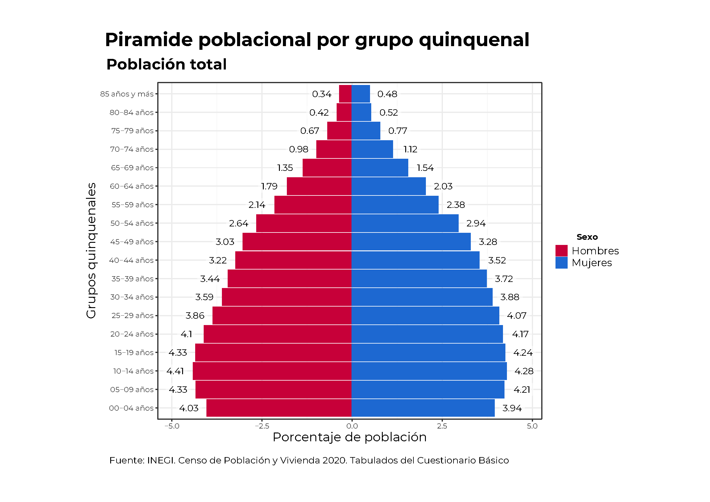
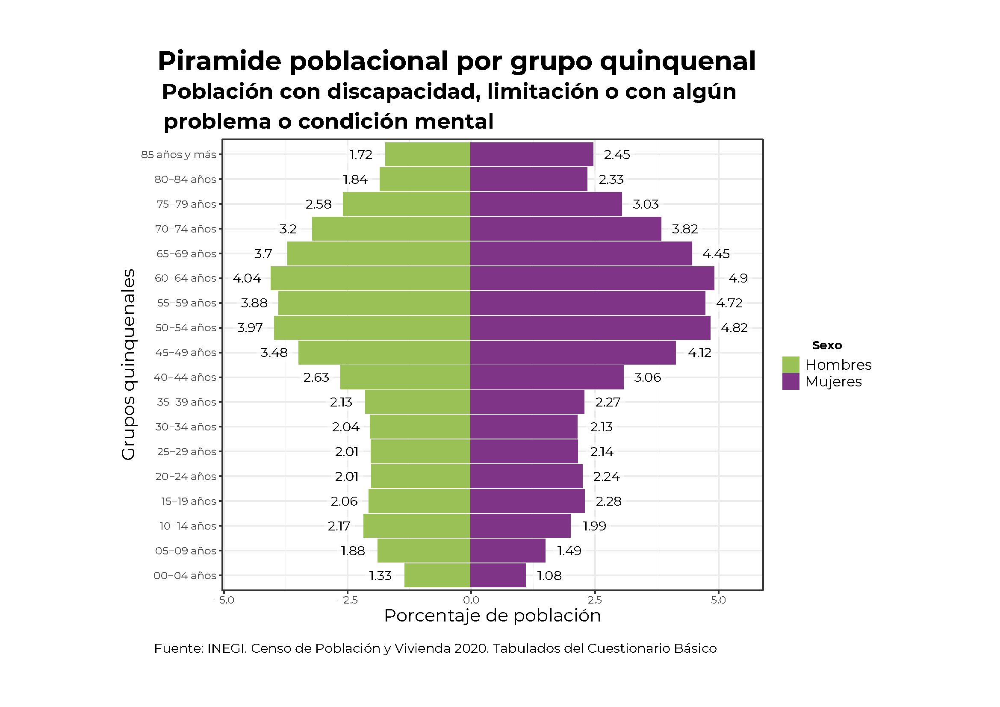
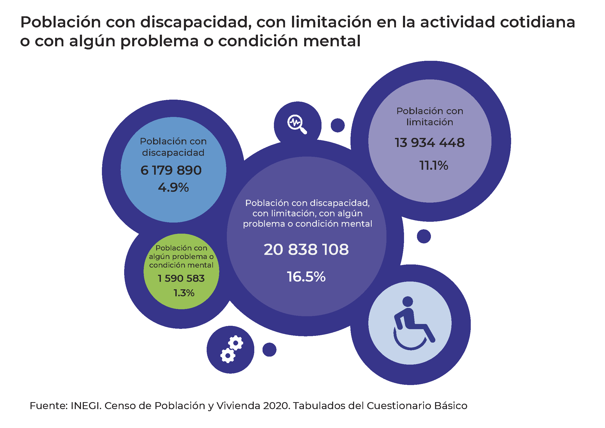
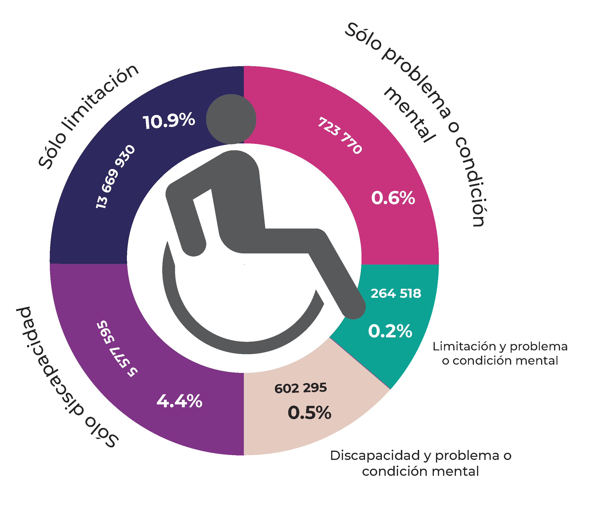

```{=html}
<style type="text/css">
body {
text-align: justify;
font-style: normal;
font-family: "Montserrat";
font-size: 12px
}
h1.title {
  font-size: 40px;
  color: #000D3B;
}
h1 {
  color: #B6854D;
}
h2 {
  color: #172984;
}
h3 {
  color: #172984;
}
</style>
```

```{=html}
<style>
.nav>li>a {
    position: relative;
    display: block;
    padding: 10px 15px;
    color: #1C3BA4
}
.nav-pills>li.active>a, .nav-pills>li.active>a:hover, .nav-pills>li>a:focus {
    color: #ffffff;
    background-color: #09C2BC
}
</style>
```

```{=html}
<style>
.tile1-text {
    position: relative;
    display: block;
    padding: 10px 15px;
    color: #0A6A87;
    list-style: none;
}
.top1-tiles a:nth-of-type(1):hover, .top-tiles1 a:nth-of-type(1):focus{
    color: #ffffff;
    background: #0A6A87
}
</style>
```

```{=html}
<style>
.tile2-text {
    position: relative;
    display: block;
    padding: 10px 15px;
    color: #0A6CC8;
    list-style: none;
}
.top2-tiles a:nth-of-type(1):hover, .top2-tiles a:nth-of-type(1):focus{
    color: #ffffff;
    background: #0A6CC8
}
</style>
```

```{=html}
<style>
.math {
  font-size: 15px;
  color: #1e42ab;
}
</style>
```

```{r setup, include=FALSE}
knitr::opts_chunk$set(echo = TRUE, message = FALSE, warning = FALSE, cache = TRUE, 
                      cache.lazy = FALSE, class.source = "fold-show")
knitr::opts_knit$set(root.dir = here::here())
setwd(here::here())
```

```{r,echo=FALSE, eval=FALSE}
rm(list = ls())
```

```{r, echo = FALSE, results=FALSE}
# Paquetes que se usaron en el documento 
require(dplyr)          #A Grammar of Data Manipulation 
require(RColorBrewer)
require(knitr)
require(kableExtra)
require(openxlsx)
require(readxl)
require(rgdal)          #Para importar shapefiles. 
require(unikn)          # Paleta de colores
require(ggplot2)
require(ggpubr)
require(Hmisc)
require(tidyverse)
require(tibble)
require(viridis)
```

```{r, echo = FALSE, results=FALSE}
# Se descargan las fuentes de la google fonts
require(showtext)
library(extrafont)
# activar showtext
windowsFonts()
```


## Los Derechos de las Personas con Discapacidad en México  

Cuando se habla de los **Derechos de las Personas con Discapacidad en México**, es un tema que ha ido tomando relevancia desde el año 2011 con la promulgación de la **Ley General para la Inclusión de las Personas con Discapacidad**, que marcó un hito importante en el reconocimiento y protección de sus derechos. En diferentes contextos de derechos humanos, los temas en materia de género en México comenzaron a tomar relevancia significativa en el año 1974, con la reforma al Artículo 4° Constitucional que estableció la igualdad jurídica entre hombres y mujeres. Por su parte, los temas relacionados con los derechos de las personas indígenas y afrodescendientes en México empezaron a tomar mayor relevancia a partir de 1992, con el reconocimiento constitucional de la composición pluricultural de la nación, fortalecido posteriormente con la reforma constitucional de 2001 que reconoció los derechos de los pueblos indígenas. Este marco normativo emergente ha evidenciado la histórica marginación y falta de reconocimiento que estos grupos poblacionales han enfrentado. 

###  Instrumentos en México  

Existen diversos instrumentos aplicados en México que recopilan información sobre la población con discapacidad:

- Censos generales de Población y Vivienda (Útima actualización 2020)
- Encuesta Nacional de Empleo y Seguridad Social (`ENESS`)  (Útima actualización 2017);
- Encuesta Nacional de Salud y Nutrición (Útima actualización 2023); 
- Encuesta Nacional de Uso del Tiempo (`ENESS`)  (Útima actualización 2024);
- Encuesta Nacional de Ingresos y Gastos en los Hogares (`ENIGH`) (Útima actualización 2022);
- Encuestas Nacional de la Dinámica Demográfica (`ENADID`) (Útima actualización 2023);
- Encuestas Nacional de la Dinámica y las Relaciones en los Hogares (`ENDIREH`) (Útima actualización 2021);
- Encuesta Nacional sobre Salud y Envejecimiento en México (`ENASEM`) (Útima actualización 2021).


## Censo de Población y Vivienda 2020  

El sistema censal mexicano ha experimentado una notable transformación desde sus inicios en 1895, cuando el INEGI comenzó a realizar estos ejercicios estadísticos. Lo que comenzó como un simple conteo poblacional que registraba datos básicos (número de habitantes, edad, sexo, estado civil y nivel de alfabetización) evolucionó significativamente entre 2000 y 2010. Durante este período, el censo amplió su alcance para incluir aspectos más complejos como las características de la vivienda, patrones de migración y condiciones económicas de la población. En 2002, se introdujo el enfoque de la **CIF** en la **Encuesta Nacional de Evaluación al Desempeño (`ENED`)**, incorporando preguntas para identificar la dificultad para realizar tareas (INEGI, 2017).    

Un avance fundamental en esta evolución fue la incorporación del **cuestionario del Grupo de Washington (`WG`)** en el **Censo 2020**. Este cambio metodológico representó un avance crucial en la medición de la discapacidad, al reemplazar el enfoque de autopercepción por un sistema basado en la evaluación de limitaciones funcionales. El nuevo método evalúa seis dimensiones: la capacidad de ver, oír, caminar o subir escaleras, recordar o concentrarse, realizar el aseo personal y comunicarse. Esta metodología permite una medición más precisa de la discapacidad, facilita comparaciones internacionales y contribuye al desarrollo de políticas públicas más efectivas en materia de inclusión y accesibilidad.  

### Cuestionarios anteriores al 2020   

En los **censos anteriores al 2020**, el **enfoque de autopercepción** consistía en preguntas más generales y menos estructuradas sobre discapacidad. Las principales diferencias eran:

En los censos 2000-2010:

- Se preguntaba de manera general sobre **dificultades físicas** o **sensoriales**   
- **No se medía con precisión la severidad de las limitaciones**   
- **No había una medición del impacto en la vida diaria**

### Inclusión del Cuestionario del Grupo de Washington (Censo 2020)

Para el **Censo de Población y Vivienda 2020**, el INEGI incorporó el **conjunto de preguntas del Grupo de Washington sobre Discapacidad (WG-SS, por sus siglas en inglés)**. Este grupo de preguntas busca medir la discapacidad en función de **limitaciones en la actividad** en lugar de una simple declaración de discapacidad.  

El cuestionario del **Grupo de Washington** en el **Censo 2020** incluyó seis preguntas clave sobre **dificultades funcionales** en:

1. **Ver:** Abarca la pérdida total de la vista en uno o ambos ojos, así como a los débiles visuales y a los que aun usando lentes no pueden ver bien por lo avanzado de sus problemas visuales.   

2. **Oír:** Incluye a las personas que no pueden oír, así como aquellas que presentan dificultad para escuchar (debilidad auditiva), en uno o ambos oídos, a las que aun usando aparato auditivo tiene dificultad para escuchar debido a lo avanzado de su problema.  

3. **Caminar, subir o bajar**. Hace referencia a la dificultad de una persona para moverse, caminar, desplazarse o subir escaleras debido a la falta de toda o una parte de sus piernas; incluye también a quienes teniendo sus piernas no tienen movimiento o presentan restricciones para moverse, de tal forma que necesitan ayuda de otras personas, silla de ruedas u otro aparato, como andadera o pierna artificial.  

4. **Recordar o concentrarse**. Incluye las limitaciones o dificultades para aprender una nueva tarea o para poner atención por determinado tiempo, así como limitaciones para recordar información o actividades que se deben realizar en la vida cotidiana.  

5. **Dificultad para bañarse, vestirse o comer.** Son los problemas que tiene una persona para desarrollar tareas del cuidado personal o cuidar su salud.  

6. **Hablar o comunicarse**. Hace referencia a los problemas para comunicarse con los demás, debido a limitaciones para hablar o porque no pueden platicar o conversar de forma comprensible.  

Estas preguntas permiten **comparaciones internacionales** y proporcionan una mejor medición de la discapacidad en términos de **grados de dificultad**, ayudando a mejorar políticas públicas de inclusión y accesibilidad.   

Se cargan las bases de datos de discapacidad, obtenido del los tabulados básicos del Censo de Población y Vivienda 2020 [(Enlace)](https://www.inegi.org.mx/programas/ccpv/2020/#tabulados)  

```{r}
data <- read.xlsx("Bases/cpv2020_b_eum_06_discapacidad.xlsx", 
                  sheet = "02", 
                  colNames = FALSE,
                  startRow = 10, 
                  skipEmptyRows = TRUE)
# Columnas
colnames(data) <- c("Entidad Federativa", "Sexo", "Grupos quinquenales", "Población Total", 
                    "Población con discapacidad, limitación o con algún problema o condición mental",
                    "Con discapacidad (Total)",
                    "Con discapacidad (Ver aun usando lentes)",
                    "Con discapacidad (Oír aun usando aparato auditivo)",
                    "Con discapacidad (Caminar, subir o bajar)",
                    "Con discapacidad (Recordar o concentranrse)",
                    "Con discapacidad (Bañarse, vestirse o comer)",
                    "Con discapacidad (Hablar o comunicarse)",
                    "Con limitación (Total)",
                    "Con limitación (Ver aun usando lentes)",
                    "Con limitación (Oír aun usando aparato auditivo)",
                    "Con limitación (Caminar, subir o bajar)",
                    "Con limitación (Recordar o concentranrse)",
                    "Con limitación (Bañarse, vestirse o comer)",
                    "Con limitación (Hablar o comunicarse)",
                    "Población con algún problema o condición mental",
                    "Sin discapacidad, limitación, problema o condición mental",
                    "No especificado")
```

Filtramos los datos a nivel nacional 

```{r}
data <- data %>% 
         filter(`Entidad Federativa` %in% "Estados Unidos Mexicanos")
```


<div style="height:500px;overflow:auto;">
```{r, echo = FALSE}
require(gt)

data %>% 
 gt() %>%
  tab_header(title = "Población total por entidad federativa, sexo, grupos quinquenales según discapacidad o limitación por tipo de actividad cotidiana que realiza y población con algún problema o condición mental ",
             subtitle = "Censo de Población y Vivienda 2020") %>%
   tab_footnote(footnote = "Fuente: INEGI. Censo de Población y Vivienda 2020. Tabulados del Cuestionario Básico") %>%
     fmt_integer(columns = names(data)[4:22], 
                sep_mark = " ") %>%
     tab_options(heading.title.font.size = 14, 
                 heading.subtitle.font.size = 12,
                 table.font.names = "Century Gothic",
                 table.font.size = 10,
                 data_row.padding = px(1)) %>%
      tab_style(style = list(cell_text(align = "left",
                                       weight = 'bold')),
                locations = list(cells_title(groups = c("title")))) %>%
       tab_style(style = list(cell_text(align = "left")),
                 locations = list(cells_title(groups = c("subtitle")))) %>%
        cols_width(starts_with("Entidad Federativa") ~ px(200),
                   everything() ~ px(100)) %>%
         as_raw_html() 
```
</div>

### Población Total   

```{r}
## Población total
Totales <- data %>% 
            filter(Sexo %in% "Total" & `Grupos quinquenales` %in% "Total") %>% 
             select(-c(`Entidad Federativa`, Sexo, `Grupos quinquenales`)) %>%
              t() 

## Población total (Hombres)
Hombres <- data %>% 
            filter(Sexo %in% "Hombres" & `Grupos quinquenales` %in% "Total") %>% 
             select(-c(`Entidad Federativa`, Sexo, `Grupos quinquenales`)) %>%
              t()

## Población total (Mujeres)
Mujeres <- data %>% 
            filter(Sexo %in% "Mujeres" & `Grupos quinquenales` %in% "Total") %>% 
             select(-c(`Entidad Federativa`, Sexo, `Grupos quinquenales`)) %>%

                t() 
```

```{r, eval = FALSE, class.source = "fold-hide"}
tabla <- data %>% 
          filter(Sexo %nin% "Total" & `Grupos quinquenales`%nin% c("Total", "No especificado")) %>% 
           mutate(percent_POBTOT = case_when(Sexo %in% "Hombres" ~ .$`Población Total` / Totales["Población Total",] * 100,
                                             Sexo %in% "Mujeres" ~ .$`Población Total` / Totales["Población Total",] * 100)) %>%
            mutate(percent = ifelse(Sexo %in% "Hombres", -1 * .$percent_POBTOT, .$percent_POBTOT))

p <- tabla %>% 
      ggplot(aes(x = percent,
                 y = `Grupos quinquenales`)) + 
       geom_col(aes(color = Sexo, fill = Sexo)) + 
        geom_smooth(color = "black", method = "loess", se = FALSE, show.legend = FALSE, size = 2) +
        geom_label(aes(x = ifelse(percent < 0, percent -0.5, percent + 0.5),
                   label = round(abs(percent), 2)),
                   fill = "white",
                   alpha = 0.5, 
                   family = "Montserrat",
                   label.size = 0) + 
         theme_bw() + 
          theme(plot.title = element_text(size = 22, hjust = 0.15, family = "Montserrat", face = "bold"),
                plot.subtitle = element_text(size = 18, hjust = 0, family = "Montserrat", face = "bold"),
                plot.caption = element_text(size = 11, hjust = 0.2, vjust = 1, family = "Montserrat"), 
                axis.text = element_text(family = "Montserrat"), 
                axis.title = element_text(family = "Montserrat", size = 15), 
                legend.key.size = unit(0.5, "cm"),
                legend.text = element_text(size = 12, family = "Montserrat"), 
                legend.title = element_text(size = 10, hjust = 0.5, family = "Montserrat", face = "bold"),
                legend.position = "right"
               ) + 
           scale_fill_manual(values = c("#C70039", "#1d68d1")) + 
            scale_color_manual(values = c("#C70039", "#1d68d1")) +
             labs(title = "Piramide poblacional por grupo quinquenal",
                  subtitle = "Población total",
                  x = "Porcentaje de población",
                  fill = "Sexo",
                  color = "Sexo",
                  caption = expression(paste("Fuente: INEGI. Censo de Población y Vivienda 2020. Tabulados del Cuestionario Básico")))
  
p

#path = "Output/Piramide Población Total.pdf"
#ggexport(p, filename = path ,width = 9, height = 7, device = "cairo")
```

```{r, eval = FALSE, class.source = "fold-hide"}
tabla <- data %>% 
          filter(Sexo %nin% "Total" & `Grupos quinquenales`%nin% c("Total", "No especificado")) %>% 
           mutate(percent_POBTOT = case_when(Sexo %in% "Hombres" ~ .$`Población Total` / Totales["Población Total",] * 100,
                                             Sexo %in% "Mujeres" ~ .$`Población Total` / Totales["Población Total",] * 100)) %>%
            mutate(percent = ifelse(Sexo %in% "Hombres", -1 * .$percent_POBTOT, .$percent_POBTOT))

p <- tabla %>% 
      arrange(`Grupos quinquenales`) |>
      ggplot(aes(x = percent, 
                 y = `Grupos quinquenales`,
                 group = Sexo)) + 
        geom_point(aes(color = Sexo, fill = Sexo), size = 2) + 
         theme_bw() + 
          theme(plot.title = element_text(size = 22, hjust = 0.15, family = "Montserrat", face = "bold"),
                plot.subtitle = element_text(size = 18, hjust = 0, family = "Montserrat", face = "bold"),
                plot.caption = element_text(size = 11, hjust = 0.2, vjust = 1, family = "Montserrat"), 
                axis.text = element_text(family = "Montserrat"), 
                axis.title = element_text(family = "Montserrat", size = 15), 
                legend.key.size = unit(0.5, "cm"),
                legend.text = element_text(size = 12, family = "Montserrat"), 
                legend.title = element_text(size = 10, hjust = 0.5, family = "Montserrat", face = "bold"),
                legend.position = "right"
               ) + 
           scale_fill_manual(values = c("#C70039", "#1d68d1")) + 
            scale_color_manual(values = c("#C70039", "#1d68d1")) +
             labs(title = "Piramide poblacional por grupo quinquenal",
                  subtitle = "Población total",
                  x = "Porcentaje de población",
                  fill = "Sexo",
                  color = "Sexo",
                  caption = expression(paste("Fuente: INEGI. Censo de Población y Vivienda 2020. Tabulados del Cuestionario Básico")))
  
p

#path = "Output/Piramide Población Total.pdf"
#ggexport(p, filename = path ,width = 9, height = 7, device = "cairo")
```

{width="90%" fig-align="center"}


### Población con discapacidad, limitación o con algún problema o condición mental

```{r, eval = FALSE, class.source = "fold-hide"}
require(ggplot2)
require(ggpubr)
require(Hmisc)
require(tidyverse)
require(tibble)
require(viridis)

paleta <- colorRampPalette(pals::kovesi.linear_blue_5_95_c73(2))(2)

tabla <- data %>% 
          filter(Sexo %nin% "Total" & `Grupos quinquenales`%nin% c("Total", "No especificado")) %>% 
           mutate(percent_POBTOT = case_when(Sexo %in% "Hombres" ~ .$`Población con discapacidad, limitación o con algún problema o condición mental`/ Totales["Población con discapacidad, limitación o con algún problema o condición mental",] * 100,
                                             Sexo %in% "Mujeres" ~ .$`Población con discapacidad, limitación o con algún problema o condición mental`/ Totales["Población con discapacidad, limitación o con algún problema o condición mental",] * 100)) %>%
            mutate(percent = ifelse(Sexo %in% "Hombres", -1 * .$percent_POBTOT, .$percent_POBTOT))

p <- tabla %>% 
      ggplot(aes(x = percent,
                 y = `Grupos quinquenales`)) + 
       geom_col(aes(color = Sexo, fill = Sexo)) + 
        geom_smooth(color = "black", method = "loess", se = FALSE, show.legend = FALSE, size = 2) +
        geom_label(aes(x = ifelse(percent < 0, percent -0.5, percent + 0.5),
                   label = round(abs(percent), 2)),
                   fill = "white",
                   alpha = 0.5, 
                   family = "Montserrat",
                   label.size = 0) + 
         theme_bw() + 
          theme(plot.title = element_text(size = 22, hjust = 0.15, family = "Montserrat", face = "bold"),
                plot.subtitle = element_text(size = 18, hjust = 0, family = "Montserrat", face = "bold"),
                plot.caption = element_text(size = 11, hjust = 0.2, vjust = 1, family = "Montserrat"), 
                axis.text = element_text(family = "Montserrat"), 
                axis.title = element_text(family = "Montserrat", size = 15), 
                legend.key.size = unit(0.5, "cm"),
                legend.text = element_text(size = 12, family = "Montserrat"), 
                legend.title = element_text(size = 10, hjust = 0.5, family = "Montserrat", face = "bold"),
                legend.position = "right"
               ) + 
           scale_fill_manual(values = paleta) + 
            scale_color_manual(values = paleta) +
             labs(title = "Piramide poblacional por grupo quinquenal",
                  subtitle = stringr::str_wrap("Población con discapacidad, limitación o con algún problema o condición mental", 50),
                  x = "Porcentaje de población",
                  fill = "Sexo",
                  color = "Sexo",
                  caption = expression(paste("Fuente: INEGI. Censo de Población y Vivienda 2020. Tabulados del Cuestionario Básico")))
  
p

#path = "Output/Piramide Población con discapacidad, limitación o con algún problema o condición mental.pdf"
#ggexport(p, filename = path ,width = 9, height = 7, device = "cairo")
```

{width="90%" fig-align="center"}

1 Incluye una estimación de población de 6 337 751 personas que corresponden a 1 588 422 viviendas sin información de ocupantes y menores omitidos.
2 La suma de la población con discapacidad, limitación y con algún problema o condición mental es mayor, a la población total en dicha situación, por aquellas personas que tienen más de una discapacidad o limitación.


### Población con discapacidad, con limitación en la actividad cotidiana o con algún problema o condición mental 

{width="90%" fig-align="center"}

{width="70%" fig-align="center"}

3 La suma de las actividades cotidianas puede ser mayor al total por aquellas personas que tienen más de una discapacidad.
4 La suma de las actividades cotidianas puede ser mayor al total por aquellas personas que tienen más de una limitación.


## Referencias  

Instituto Nacional de Estadística y Geografía [INEGI], 2017, La discapacidad en México,
datos al 2014. Versión 2017, disponible en https://www.inegi.org.mx/contenidos/productos/prod_serv/contenidos/espanol/bvinegi/productos/nueva_estruc/702825094409.pdf