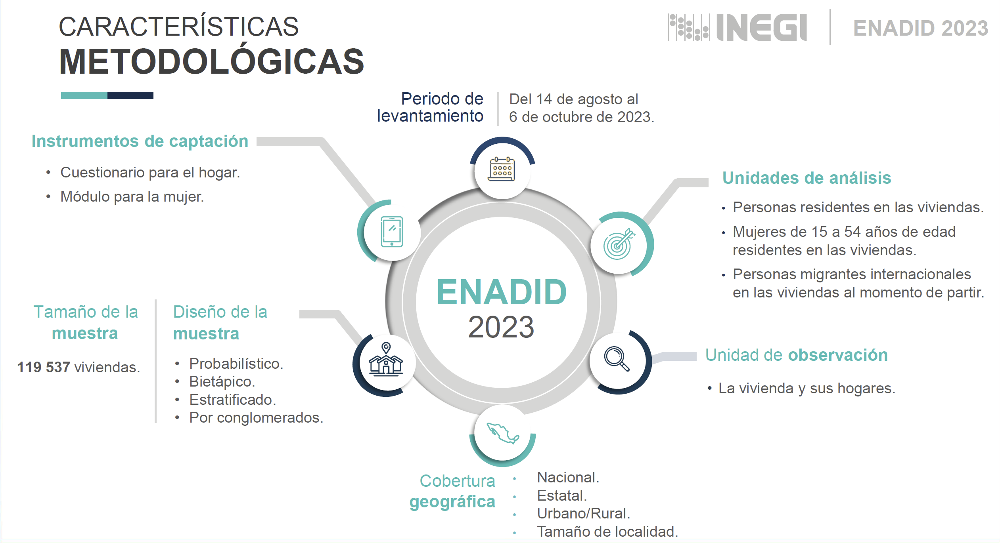
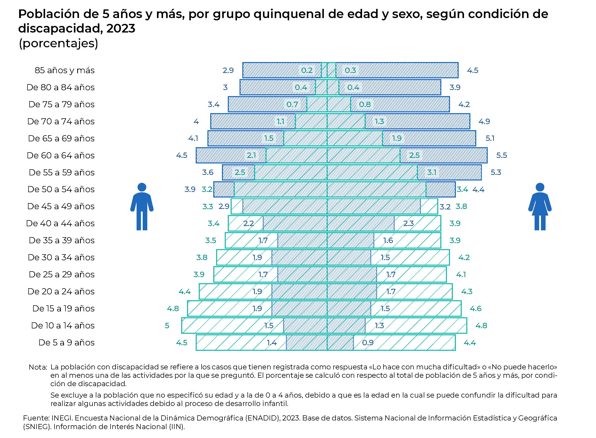
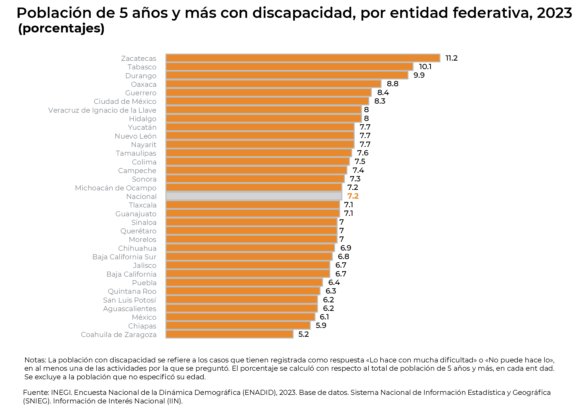
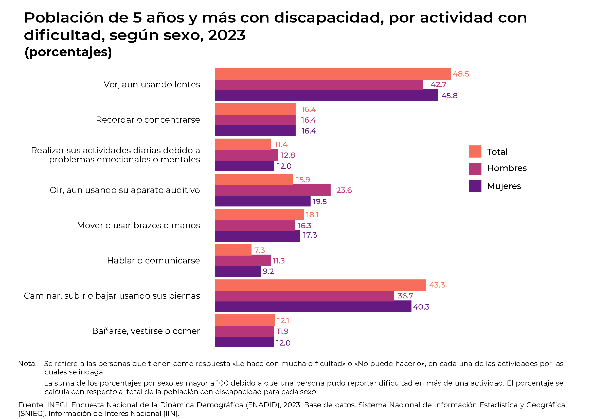
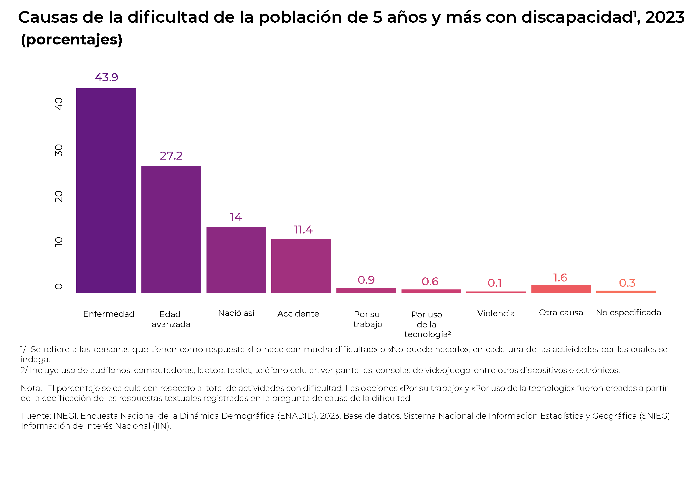

```{=html}
<style type="text/css">
body {
text-align: justify;
font-style: normal;
font-family: "Montserrat";
font-size: 12px
}
h1.title {
  font-size: 40px;
  color: #000D3B;
}
h1 {
  color: #B6854D;
}
h2 {
  color: #172984;
}
h3 {
  color: #172984;
}
</style>
```

```{=html}
<style>
.nav>li>a {
    position: relative;
    display: block;
    padding: 10px 15px;
    color: #1C3BA4
}
.nav-pills>li.active>a, .nav-pills>li.active>a:hover, .nav-pills>li>a:focus {
    color: #ffffff;
    background-color: #09C2BC
}
</style>
```

```{=html}
<style>
.tile1-text {
    position: relative;
    display: block;
    padding: 10px 15px;
    color: #0A6A87;
    list-style: none;
}
.top1-tiles a:nth-of-type(1):hover, .top-tiles1 a:nth-of-type(1):focus{
    color: #ffffff;
    background: #0A6A87
}
</style>
```

```{=html}
<style>
.tile2-text {
    position: relative;
    display: block;
    padding: 10px 15px;
    color: #0A6CC8;
    list-style: none;
}
.top2-tiles a:nth-of-type(1):hover, .top2-tiles a:nth-of-type(1):focus{
    color: #ffffff;
    background: #0A6CC8
}
</style>
```

```{=html}
<style>
.math {
  font-size: 15px;
  color: #1e42ab;
}
</style>
```

```{r setup, include=FALSE}
knitr::opts_chunk$set(echo = TRUE, message = FALSE, warning = FALSE, cache = TRUE, 
                      cache.lazy = FALSE, class.source = "fold-show")
knitr::opts_knit$set(root.dir = here::here())
setwd(here::here())
```

```{r,echo=FALSE, eval=FALSE}
rm(list = ls())
```

```{r, echo = FALSE, results=FALSE}
# Paquetes que se usaron en el documento 
require(dplyr)          #A Grammar of Data Manipulation 
require(RColorBrewer)
require(knitr)
require(kableExtra)
require(openxlsx)
require(readxl)
require(rgdal)          #Para importar shapefiles. 
require(unikn)          # Paleta de colores
require(ggplot2)
require(ggpubr)
require(Hmisc)
require(tidyverse)
require(tibble)
require(viridis)
require(janitor)
library(plotly)
library(packcircles)
```

```{r, echo = FALSE, results=FALSE}
# Se descargan las fuentes de la google fonts
require(showtext)
library(extrafont)
# activar showtext
windowsFonts()
```


## Encuesta Nacional de la Dinámica Demográfica (ENADID), 2023 

La **Encuesta Nacional de la Dinámica Demográfica (ENADID)** es una encuesta estadística que se realiza en México y tiene como objetivo generar información sobre los principales componentes de la dinámica demográfica de la población, como la fecundidad, mortalidad, migración y nupcialidad, así como aspectos de salud sexual y reproductiva. 


- **Institución responsable:** Es realizada por el **Instituto Nacional de Estadística y Geografía (INEGI)**, en coordinación con el **Consejo Nacional de Población (CONAPO)** y otras instituciones.
- **Periodicidad:** Se ha levantado aproximadamente cada cinco años desde 1992. Las ediciones más recientes son de **1992, 1997, 2006, 2009, 2014 y 2018**.
- **Cobertura:** Es una encuesta nacional representativa, tanto a nivel nacional como por entidad federativa y zonas urbanas y rurales.
- **Población objetivo:** Personas que residen en viviendas particulares en México.
 
**Temas que aborda la ENADID** 

- **Fecundidad:** Número de hijos nacidos vivos, hijos sobrevivientes, planificación familiar.
- **Salud sexual y reproductiva:** Uso de métodos anticonceptivos, acceso a servicios de salud.
- **Mortalidad infantil:** Defunciones de niños menores de cinco años.
- **Nupcialidad y unión conyugal:** Edad al primer matrimonio o unión, duración de las uniones.
- **Migración interna e internacional:** Lugar de residencia anterior, motivos de migración, retorno de migrantes.
- **Características sociodemográficas:** Edad, sexo, nivel educativo, condición de actividad económica, entre otras.  


**Diseño muestral**   

<br>

{width="90%" fig-align="center"}
<br>
<br>

**La Convención sobre los Derechos de las Personas con Discapacidad (`CDPCD`)**   

En este contexto, la Convención sobre los Derechos de las Personas con Discapacidad (CDPCD) establece en su Artículo 31 lineamientos específicos sobre la recopilación de datos estadísticos, instando a los Estados miembros a mantener información actualizada sobre esta población[^1]. En consonancia con esta directriz, el Instituto Nacional de Estadística y Geografía (INEGI) presenta un análisis estadístico sobre la población con discapacidad de 5 años y más, basado en los resultados de la Encuesta Nacional de la Dinámica Demográfica (ENADID) 2023.

[^1]:Recomendación del Grupo de Washington sobre Estadísticas de Discapacidad. Por los procesos del desarrollo infantil, especialmente en personas con menos de 5 años, se puede confundir la dificultad para realizar alguna de las actividades básicas; sin embargo, puede ser consecuencia de que aún no se adquiere por completo la habilidad para realizarla; por ejemplo, caminar, hablar o el autocuidado(Washington Group on Disability Statistics [WG], 2020).
https://www.washingtongroup-disability.com/fileadmin/uploads/wg/Documents/primer.pdf

**Resumen**  

- Para el año 2023, según los datos estadísticos más recientes, la población de 5 años y más que vive con algún tipo de discapacidad en México alcanzó la cifra de **8.8 millones de personas**, con una distribución por género que muestra que el **46.5 % son hombres** y el **53.5 % son mujeres**.
- El estado de **Zacatecas** destacó notablemente en las estadísticas nacionales al registrar el porcentaje más elevado de población de 5 años y más con discapacidad, alcanzando un significativo **11.2 por ciento de su población total** en este grupo demográfico.
- En cuanto a la **participación en actividades económicas**, se observó una marcada diferencia entre géneros en la población de 15 años y más con discapacidad: los hombres mostraron una participación económica considerablemente mayor, alcanzando el 51.5 % de actividad laboral, mientras que en el caso de las mujeres, esta cifra se situó en el 31.3 %, evidenciando una brecha significativa en la inserción al mercado laboral. 


### Población de 5 años y más, por grupo quinquenal de edad y sexo, según condición de discapacidad    

Según los datos más recientes de la Encuesta Nacional Demográfica (`ENADID 2023`), la **población mexicana de 5 años y más** ascendió a **121.6 millones de habitantes**. De este total, aproximadamente **8.8 millones de personas (7.2 %) presentaron alguna discapacidad**, distribuidos entre **4.7 millones de mujeres (53.5 %)** y **4.1 millones de hombres (46.5 %)**. El análisis demográfico revela que la mayor proporción de personas con discapacidad corresponde al segmento de adultos mayores (60 años y más), representando el 50.0 % del total.  

```{r, class.source = "fold-hide", eval = FALSE}
require(readxl)
require(ggplot2)
require(ggpubr)
require(Hmisc)
require(tidyverse)
require(tibble)
require(data.table)
require(ggpattern) 

P.Discapacidad <- read_xlsx(paste0(here::here(), "/Bases/ENADID_2023.xlsx"), sheet = "Grupos de edad", range = "A4:E21")

levels = c("De 0 a 4 años", "De 5 a 9 años", "De 10 a 14 años", "De 15 a 19 años", "De 20 a 24 años", "De 25 a 29 años",
           "De 30 a 34 años", "De 35 a 39 años", "De 40 a 44 años", "De 45 a 49 años", "De 50 a 54 años", "De 55 a 59 años",
           "De 60 a 64 años", "De 65 a 69 años", "De 70 a 74 años", "De 75 a 79 años", "De 80 a 84 años", "85 años y más")

tabla.Población <- P.Discapacidad %>% 
                    select(Grupos, "%H_SD", "%M_SD") %>%
                     melt() %>% 
                      mutate(percent = ifelse(variable %in% "%H_SD", -1 * .$value, .$value)) %>% 
                       mutate(Grupos = factor(.$Grupos, levels = levels))

tabla.Discapacidad <- P.Discapacidad %>% 
                       select(Grupos, "%H_CD", "%M_CD") %>%
                        melt() %>% 
                         mutate(percent = ifelse(variable %in% "%H_CD", -1 * .$value, .$value)) %>% 
                          mutate(Grupos = factor(.$Grupos, levels = levels))

p <- ggplot() + 
        geom_col_pattern(data = tabla.Discapacidad,
                aes(x = percent,
                    y = Grupos),
                    color = "#1f6abd",
                    pattern_fill = "#1f6abd",
                    pattern_color = "transparent",
                    pattern_angle = 115,
                    pattern_density = 0.01,
                    pattern_spacing = 0.005,
                    fill = "transparent",
                    alpha = 0.5,
                    size = 0.5) + 
         geom_col_pattern(data = tabla.Población,
                aes(x = percent,
                    y = Grupos),
                    color = "#17bab1",
                    pattern_fill = "#17bab1",
                    pattern_color = "transparent",
                    pattern_angle = 45,
                    pattern_density = 0.01,
                    pattern_spacing = 0.03,
                    
                    fill = "transparent",
                    alpha = 0.3,
                    size = 0.5) + 
        geom_label(data = tabla.Discapacidad,
                   aes(x = ifelse(percent < 0, percent -0.5, percent + 0.5),
                       y = Grupos,
                       label = round(abs(value), 1)),
                   fill = "white",
                   color = "#295d97",
                   alpha = 0.3, 
                   family = "Montserrat Medium",
                   label.size = 0) + 
        geom_label(data = tabla.Población,
                   aes(x = ifelse(percent < 0, percent -0.5, percent + 0.5),
                       y = Grupos,
                       label = round(abs(value), 1)),
                   fill = "white",
                   color = "#0e968f",
                   alpha = 0.5, 
                   family = "Montserrat Medium",
                   label.size = 0) + 
         theme_transparent() + 
          theme(plot.title = element_text(size = 22, hjust = 0.15, family = "Montserrat", face = "bold"),
                plot.subtitle = element_text(size = 18, hjust = 0, family = "Montserrat", face = "bold"),
                plot.caption = element_text(size = 11, hjust = 0.2, vjust = 1, family = "Montserrat"), 
                axis.text = element_text(family = "Montserrat"), 
                axis.title = element_text(family = "Montserrat", size = 15), 
                legend.key.size = unit(0.5, "cm"),
                legend.text = element_text(size = 12, family = "Montserrat"), 
                legend.title = element_text(size = 10, hjust = 0.5, family = "Montserrat", face = "bold"),
                legend.position = "right"
               ) + 
         #  scale_fill_manual(values = paleta) + 
          #  scale_color_manual(values = paleta) +
             labs(title = "Población de 5 años y más, por grupo quinquenal de edad y sexo, según condición de discapacidad, 2023",
                  subtitle = stringr::str_wrap("(porcentajes)", 50),
                  x = "",
                  y = "",
                  fill = "",
                  color = "",
                  caption = expression(paste("Fuente: INEGI. Encuesta Nacional de la Dinámica Demográfica (ENADID), 2023. Base de datos. Sistema Nacional de Información Estadística y Geográfica (SNIEG). Información de Interés Nacional (IIN).")))
  
p

#path = "Output/Piramide Población Total y Discapacidad_ENADID.pdf"
#ggexport(p, filename = path ,width = 9, height = 7, device = "cairo")
```

{width="90%" fig-align="center"}

#### Por estados 

De acuerdo con los datos estadísticos más recientes, las entidades federativas que presentan una mayor proporción de población con discapacidad a partir de los 5 años de edad son Zacatecas con 11.2%, Tabasco con 10.1%, Durango con 9.9% y Oaxaca con 8.8%. En contraste, las entidades que registran menores porcentajes son Coahuila (5.2%), Chiapas (5.9%), Estado de México (6.1%), así como San Luis Potosí y Aguascalientes, ambos con 6.2%.  

```{r, class.source = "fold-hide", eval = FALSE}
P.Discapacidad <- read_xlsx(paste0(here::here(), "/Bases/ENADID_2023.xlsx"), sheet = "Estados", range = "A4:C37")

tabla <- P.Discapacidad %>% 
          arrange(Porcentaje) %>% 
           mutate(color = ifelse(Entidad %in% "Nacional", "lightgrey", "#e7892c")) %>%
            as.data.frame()

Entidades <- tabla %>% pull(Entidad)  
p <- tabla %>%
      ggplot() + 
        geom_col(aes(x = Porcentaje, y = factor(Entidad, Entidades)), color = "grey", fill = tabla$color) + 
         geom_text(aes(x = Porcentaje, y = Entidad, label = Porcentaje),
                   color = "black",
                   hjust = -0.5, 
                   fontface = "bold", 
                   family = "Montserrat Medium") + 
        theme_transparent() + 
          theme(plot.title = element_text(size = 22, hjust = 0, family = "Montserrat SemiBold", face = "bold"),
                plot.subtitle = element_text(size = 18, hjust = 0, family = "Montserrat", face = "bold"),
                plot.caption = element_text(size = 11, hjust = 0.2, vjust = 1, family = "Montserrat"), 
                axis.text = element_text(family = "Montserrat"), 
                axis.title = element_text(family = "Montserrat", size = 15), 
                legend.key.size = unit(0.5, "cm"),
                legend.text = element_text(size = 12, family = "Montserrat"), 
                legend.title = element_text(size = 10, hjust = 0.5, family = "Montserrat", face = "bold"),
                legend.position = "none"
               ) + 
           scale_fill_viridis_d(option = "A", begin = 0.3, end = 0.7) + 
            scale_color_viridis_d(option = "A", begin = 0.3, end = 0.7) +
             labs(title = "Población de 5 años y más con discapacidad, por entidad federativa, 2023",
                  subtitle = stringr::str_wrap("(porcentajes)", 50),
                  x = "",
                  y = "",
                  fill = "",
                  color = "",
                  caption = expression(paste("Fuente: INEGI. Encuesta Nacional de la Dinámica Demográfica (ENADID), 2023. Base de datos. Sistema Nacional de Información Estadística y Geográfica (SNIEG). Información de Interés Nacional (IIN).")))
p

path = "Output/P.Discapacidad por estados_ENADID.pdf"
ggexport(p, filename = path ,width = 9, height = 7, device = "cairo")
```

{width="90%" fig-align="center"}


### Población de 5 años y más con discapacidad,1/ por actividad con dificultad, según sexo, 2023

En la población de 5 años y más con discapacidad, se identificaron dos limitaciones principales: la dificultad visual, incluso con el uso de lentes correctivos (45.8%), y la movilidad reducida al caminar, subir o bajar escaleras (40.3%). El análisis por género reveló que el 43.3% de mujeres y 36.7% de hombres experimentaron restricciones de movilidad, mientras que el 48.5% de mujeres y 42.7% de hombres manifestaron dificultades visuales, aun utilizando lentes correctivos.

```{r, class.source = "fold-hide", eval = FALSE}
P.Discapacidad <- read_xlsx(paste0(here::here(), "/Bases/ENADID_2023.xlsx"), sheet = "Actividad con dificultad", range = "A4:D12")

tabla <- P.Discapacidad %>% 
          melt() %>% 
           mutate(`Actividad con dificultad` = stringr::str_wrap(`Actividad con dificultad`, 50))

p <- tabla %>%
      ggplot() + 
        geom_col(aes(x = value, 
                     y = `Actividad con dificultad`,
                     color = variable, 
                     fill = variable, 
                     group = variable),
                 position = "dodge") + 
         geom_text(aes(x = value, 
                       y = `Actividad con dificultad`,
                       label = value,
                       color = variable,
                       fill = variable, 
                       group = variable),
                   position = "dodge",
                   hjust = -0.5, 
                   fontface = "bold", 
                   family = "Montserrat Medium") + 
        theme_transparent() + 
          theme(plot.title = element_text(size = 22, hjust = 0, family = "Montserrat SemiBold", face = "bold"),
                plot.subtitle = element_text(size = 18, hjust = 0, family = "Montserrat", face = "bold"),
                plot.caption = element_text(size = 11, hjust = 0.2, vjust = 1, family = "Montserrat"), 
                axis.text = element_text(family = "Montserrat"), 
                axis.title = element_text(family = "Montserrat", size = 15), 
                legend.key.size = unit(0.5, "cm"),
                legend.text = element_text(size = 12, family = "Montserrat"), 
                legend.title = element_text(size = 10, hjust = 0.5, family = "Montserrat", face = "bold"),
                legend.position = "none"
               ) + 
           scale_fill_viridis_d(option = "A", begin = 0.3, end = 0.7) + 
            scale_color_viridis_d(option = "A", begin = 0.3, end = 0.7) +
             labs(title = "Población de 5 años y más con discapacidad,1/ por actividad con dificultad, según sexo, 2023",
                  subtitle = stringr::str_wrap("(porcentajes)", 50),
                  x = "",
                  y = "",
                  fill = "",
                  color = "",
                  caption = expression(paste("Fuente: INEGI. Encuesta Nacional de la Dinámica Demográfica (ENADID), 2023. Base de datos. Sistema Nacional de Información Estadística y Geográfica (SNIEG). Información de Interés Nacional (IIN)."))) 

p

#path = "Output/P.Discapacidad por actividad_ENADID.pdf"
#ggexport(p, filename = path ,width = 9, height = 7, device = "cairo")
```
{width="90%" fig-align="center"}

### Causas de la dificultad de la población de 5 años y más con discapacidad   

Las dificultades para realizar actividades cotidianas pueden atribuirse a diversos factores, incluyendo condiciones médicas, factores ambientales e influencias socioculturales. Según el análisis de la ENADID 2023, en la población de 5 años y más con discapacidad, las causas predominantes fueron las enfermedades (43.9%) y el envejecimiento natural (27.2%). Es relevante señalar que las limitaciones derivadas de actividades laborales (0.9%) superaron a aquellas ocasionadas por incidentes de violencia (0.6%).

```{r, class.source = "fold-hide", eval = FALSE}
P.Discapacidad <- read_xlsx(paste0(here::here(), "/Bases/ENADID_2023.xlsx"), sheet = "Causas", range = "A4:B13")

levels = P.Discapacidad %>% pull(Causas)

p <- P.Discapacidad %>%
      ggplot() + 
        geom_col(aes(x = factor(Causas, levels), 
                     y = Porcentaje,
                     color = factor(Causas, levels), 
                     fill = factor(Causas, levels))
                 ) +
         geom_text(aes(x = factor(Causas, levels), 
                       y = Porcentaje,
                       label = Porcentaje,
                       color = factor(Causas, levels), 
                       fill = factor(Causas, levels)
                       ),
                   vjust = -0.5,
                   fontface = "bold", 
                   family = "Montserrat Medium") + 
        theme_transparent() + 
          theme(plot.title = element_text(size = 22, hjust = 0, family = "Montserrat SemiBold", face = "bold"),
                plot.subtitle = element_text(size = 18, hjust = 0, family = "Montserrat", face = "bold"),
                plot.caption = element_text(size = 11, hjust = 0.2, vjust = 1, family = "Montserrat"), 
                axis.text = element_text(family = "Montserrat", angle = 90, hjust = 1), 
                axis.title = element_text(family = "Montserrat", size = 15), 
                legend.key.size = unit(0.5, "cm"),
                legend.text = element_text(size = 12, family = "Montserrat"), 
                legend.title = element_text(size = 10, hjust = 0.5, family = "Montserrat", face = "bold"),
                legend.position = "none"
               ) + 
           scale_fill_viridis_d(option = "A", begin = 0.3, end = 0.7) + 
            scale_color_viridis_d(option = "A", begin = 0.3, end = 0.7) +
             labs(title = "Causas de la dificultad de la población de 5 años y más con discapacidad, 2023",
                  subtitle = stringr::str_wrap("(porcentajes)", 50),
                  x = "",
                  y = "",
                  fill = "",
                  color = "",
                  caption = expression(paste("Fuente: INEGI. Encuesta Nacional de la Dinámica Demográfica (ENADID), 2023. Base de datos. Sistema Nacional de Información Estadística y Geográfica (SNIEG). Información de Interés Nacional (IIN)."))) 

p

#path = "Output/P.Discapacidad por causas_ENADID.pdf"
#ggexport(p, filename = path ,width = 9, height = 7, device = "cairo")
```


{width="90%" fig-align="center"}

## Referencias  

INEGI. (2024). Comunicación social, Estadísticas a propósito del día internacional de las personas con discapacidad (3 de diciembre). Retrieved April 8, 2025, from https://www.un.org/es/observances/day-of-  

Librerias que se usaron en el documento

```{r, echo = FALSE, eval = TRUE}
sesion_info <- devtools::session_info()
require(knitr)
require(kableExtra)
kable(dplyr::select(tibble::as_tibble(sesion_info$packages %>% dplyr::filter(attached == TRUE)),
                    c(package, loadedversion, source))) %>%
 kable_styling(font_size = 10, 
               bootstrap_options = c("condensed", "responsive", "bordered")) %>%
  kable_classic(full_width = TRUE, html_font = "montserrat") %>% 
   scroll_box(width = "100%", height = "400px") %>%  
    gsub("font-size: initial !important;", "font-size: 10pt !important;", .)
```

<a rel="license" href="http://creativecommons.org/licenses/by/4.0/"></a><br />This work by [**Diana Villasana Ocampo**]{xmlns:cc="http://creativecommons.org/ns#" property="cc:attributionName"} is licensed under a <a rel="license" href="http://creativecommons.org/licenses/by/4.0/">Creative Commons Attribution 4.0 International License</a>.


