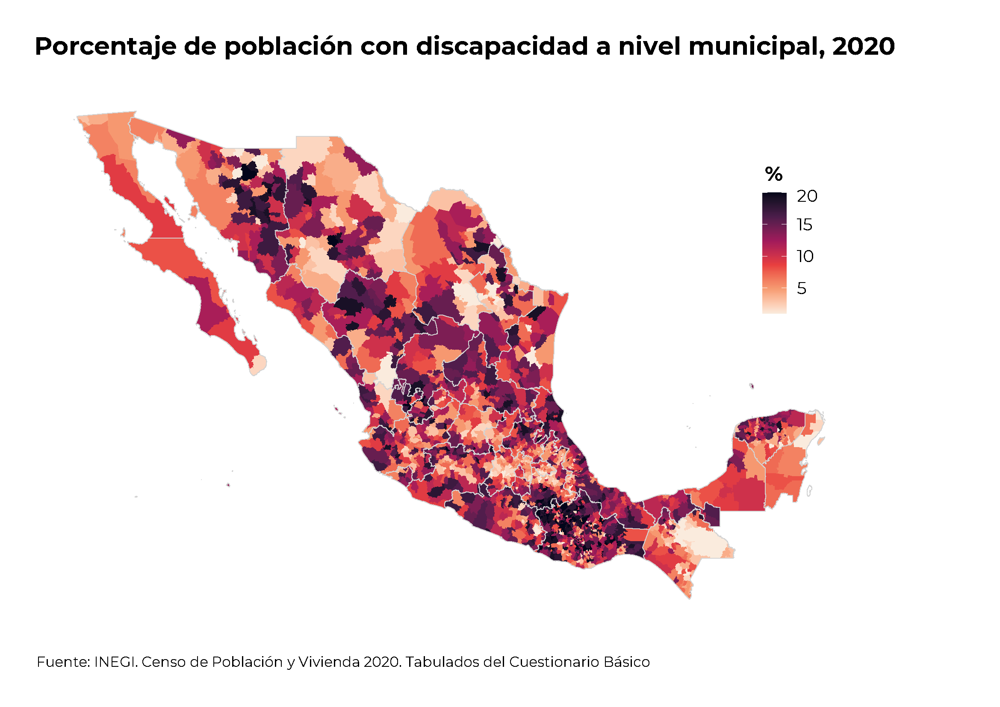

```{=html}
<style type="text/css">
body {
text-align: justify;
font-style: normal;
font-family: "Montserrat";
font-size: 12px
}
h1.title {
  font-size: 40px;
  color: #000D3B;
}
h1 {
  color: #B6854D;
}
h2 {
  color: #172984;
}
h3 {
  color: #172984;
}
</style>
```

```{=html}
<style>
.nav>li>a {
    position: relative;
    display: block;
    padding: 10px 15px;
    color: #1C3BA4
}
.nav-pills>li.active>a, .nav-pills>li.active>a:hover, .nav-pills>li>a:focus {
    color: #ffffff;
    background-color: #09C2BC
}
</style>
```

```{=html}
<style>
.tile1-text {
    position: relative;
    display: block;
    padding: 10px 15px;
    color: #0A6A87;
    list-style: none;
}
.top1-tiles a:nth-of-type(1):hover, .top-tiles1 a:nth-of-type(1):focus{
    color: #ffffff;
    background: #0A6A87
}
</style>
```

```{=html}
<style>
.tile2-text {
    position: relative;
    display: block;
    padding: 10px 15px;
    color: #0A6CC8;
    list-style: none;
}
.top2-tiles a:nth-of-type(1):hover, .top2-tiles a:nth-of-type(1):focus{
    color: #ffffff;
    background: #0A6CC8
}
</style>
```

```{=html}
<style>
.math {
  font-size: 15px;
  color: #1e42ab;
}
</style>
```

```{r setup, include=FALSE}
knitr::opts_chunk$set(echo = TRUE, message = FALSE, warning = FALSE, cache = TRUE, 
                      cache.lazy = FALSE, class.source = "fold-show")
knitr::opts_knit$set(root.dir = here::here())
setwd(here::here())
```

```{r,echo=FALSE, eval=FALSE}
rm(list = ls())
```

```{r, echo = FALSE, results=FALSE}
# Paquetes que se usaron en el documento 
require(dplyr)          #A Grammar of Data Manipulation 
require(RColorBrewer)
require(knitr)
require(kableExtra)
require(openxlsx)
require(readxl)
require(rgdal)          #Para importar shapefiles. 
require(unikn)          # Paleta de colores
require(ggplot2)
require(ggpubr)
require(Hmisc)
require(tidyverse)
require(tibble)
require(viridis)
```

```{r, echo = FALSE, results=FALSE}
# Se descargan las fuentes de la google fonts
require(showtext)
library(extrafont)
# activar showtext
windowsFonts()
```

## Censo de Población y Vivienda 2020

En el Censo de Población y Vivienda, la población con discapacidad se estructura a través de una serie de preguntas y variables diseñadas para identificar a las personas con diferentes tipos y grados de discapacidad. El objetivo principal es obtener datos precisos que permitan conocer la magnitud, distribución y características de esta población para la formulación de políticas públicas y la asignación de recursos.

Las principales preguntas y variables que se consideran en el Censo para identificar a la población con discapacidad son:

**Dificultad para realizar actividades básicas:** Se pregunta sobre el grado de dificultad que tiene la persona para realizar actividades consideradas fundamentales en la vida diaria. Estas actividades incluyen:

-   **Ver:** Aunque use lentes.
-   **Oír:** Aunque use aparato auditivo.
-   **Caminar, subir o bajar:** Usando sus piernas.
-   **Recordar o concentrarse:** Incluye dificultades para aprender cosas nuevas o mantener la atención.
-   **Bañarse, vestirse o comer:** Actividades de cuidado personal.
-   **Hablar o comunicarse:** Entender o ser entendido por otras personas.
-   **Mover o usar brazos o manos.**

**Grado de dificultad:** Para cada una de las actividades mencionadas, se ofrecen diferentes opciones de respuesta que indican el nivel de dificultad:

-   No tiene dificultad.

-   Poca dificultad.

-   Mucha dificultad.

-   No puede hacerlo.

**Problema o condición mental:** Se incluye una pregunta directa sobre si la persona tiene algún problema o condición mental, como autismo, síndrome de Down, esquizofrenia, etc.

**Causa de la limitación o discapacidad:** En algunos cuestionarios ampliados del Censo, se pregunta sobre la causa principal de la limitación, discapacidad o problema mental. Esto ayuda a entender el origen de las discapacidades.   

<p align="center">
  
</p>
**Elaboración propia**  

## Marco Geoestadístico Nacional (`MGN`)

El **Marco Geoestadístico Nacional (MGN)** del Instituto Nacional de Estadística y Geografía (INEGI) es un **sistema único y de carácter nacional** diseñado para **referenciar geográficamente la información estadística** que se genera a través de los censos y encuestas que realiza el Instituto, así como otra información estadística de interés nacional.

-   **Área Geoestadística Estatal (AGEE)**
-   **Área Geoestadística Municipal (AGEM)**
-   **Área Geoestadística Básica (AGEB) urbana y rural**
-   **Localidad geoestadística urbana y rural**
-   **Manzana geoestadística**
-   **Vialidad**
-   **Frente de manzana**

## Shapefiles

A continuación, se leen y se transforman los shapefiles de las divisiones geográficas de los estados de México correspondientes a las siguientes desagregaciones geográficas.

Utilizando la paquetería `rgdal`, se definen los siguientes parámetros:

-   `readOGR`: Esta función se usa para leer shapefiles.\
-   `dsn`: Especifica la ruta al directorio que contiene el shapefile.\
-   `layer`: Especifica el nombre de la capa dentro del shapefile.\
-   `encoding`: Especifica la codificación de los caracteres, en este caso, UTF-8.\
-   `use_iconv`: Se usa para convertir la codificación si es necesario.

Una vez cargados los sahpefiles, se transforman los sistemas de coordenadas:

-   `spTransform`: Esta función se usa para transformar las coordenadas del shapefile a un nuevo sistema de referencia.\
-   `CRSobj`: Especifica el sistema de referencia de coordenadas de destino. En este caso, se usa el sistema de coordenadas geográficas (latitud y longitud) basado en el elipsoide y `datum WGS84`.

Estos pasos son cruciales para asegurar que los datos geoespaciales sean consistentes y compatibles para su uso en análisis geográficos y visualización, por ejemplo, en aplicaciones de Leaflet o cualquier otro software de mapeo.

**Shapefile estados 2020**

```{r, eval = FALSE}
shape_estados <- readOGR(dsn = "D:/MGN/MGN 2020/MGN 2020/conjunto_de_datos",
                          layer = "00ent",
                           encoding = "UTF-8",
                            use_iconv = TRUE)

shape_estados <- spTransform(shape_estados, CRSobj = CRS('+proj=longlat +ellps=WGS84 +datum=WGS84 +no_defs'))
```

**Shapefile municipios 2020**

```{r, eval = FALSE}
shape_municipios <- readOGR(dsn = "D:/MGN/MGN 2020/MGN 2020/conjunto_de_datos",
                             layer = "00mun",
                              encoding = "UTF-8",
                               use_iconv = TRUE)

shape_municipios <- shape_municipios %>%
                     sp::spChFIDs(., str_pad(shape_municipios@data$CVEGEO, 5, "left", pad = "0"))

shape_municipios <- spTransform(shape_municipios, CRSobj = CRS('+proj=longlat +ellps=WGS84 +datum=WGS84 +no_defs'))
```

Se cargan las bases de datos de discapacidad, obtenido del los tabulados básicos del Censo de Población y Vivienda 2020 [(Enlace)](https://www.inegi.org.mx/programas/ccpv/2020/#tabulados)  

```{r, eval = TRUE}
mydata <- read.xlsx("Bases/Población con discapacidad por municipios.xlsx", 
                    sheet = "Municipios", 
                    colNames = TRUE,
                    startRow = 4)
``` 


<div style="height:400px;overflow:auto;">
```{r, echo = FALSE, eval = TRUE}
require(gt)

head(mydata, 20) %>% 
 gt() %>%
  tab_header(title = "Población total   Por: Entidad y municipio   Según: Limitación o discapacidad y número",
             subtitle = "Censo de Población y Vivienda 2020") %>%
   tab_footnote(footnote = "Fuente: INEGI. Censo de Población y Vivienda 2020. Tabulados del Cuestionario Básico") %>%
     fmt_integer(columns = names(mydata)[3:14], 
                sep_mark = " ") %>%
     tab_options(heading.title.font.size = 14, 
                 heading.subtitle.font.size = 12,
                 table.font.names = "Century Gothic",
                 table.font.size = 10,
                 data_row.padding = px(1)) %>%
      tab_style(style = list(cell_text(align = "left",
                                       weight = 'bold')),
                locations = list(cells_title(groups = c("title")))) %>%
       tab_style(style = list(cell_text(align = "left")),
                 locations = list(cells_title(groups = c("subtitle")))) %>%
        cols_width(starts_with("Municipio") ~ px(300),
                   everything() ~ px(100)) %>%
         as_raw_html() 
```
</div>


### SpatialPolygons ➡️ data.frame     

**Se insertan los datos del índice de marginación y se seccionan por grado de marginación**  

Este código realiza las siguientes acciones:

- Selecciona las columnas `CVE_ENT` y `GM_2020` de dataframe `IME_2020`.   
- `stringr::str_trim(.$GM_, "both")`: Elimina los espacios en blanco al principio y al final de los valores en `GM_`.   
- `fct_relevel(..., c("Muy alto", "Alto", "Medio", "Bajo", "Muy bajo"))`: Reordena los niveles del factor `GM_` en el orden especificado.   
- `spdplyr:::left_join.Spatial()`,  Realiza un merge entre shape_estados_ y el dataframe modificado, usando `CVE_ENT` como clave.   

El resultado es un nuevo objeto Spatial (layer_estados_2020) que combina la geometría de shape_estados con la información adicional de `IME_`, incluyendo la columna `GM_` con niveles reordenados.    

```{r, class.source = "fold-show", eval = FALSE}
layer_municipios <- spdplyr:::left_join.Spatial(shape_municipios,
                                                 mydata %>% 
                                                  mutate(CVEGEO = str_pad(.$CVE_MUN, width = 5, side = "left", pad = "0")),
                                                   by = c("CVEGEO"))
```


## Mapa a nivel municipal  

Este código calcula el **porcentaje de población con discapacidad** en cada municipio y luego **clasifica esos porcentajes en vigintiles** (20 grupos de igual tamaño, ya que se usa `seq(0, 1, 0.05)` que genera cortes cada 5%).

Paso a paso:

1. **`mutate(Pob.Discapacidad = ...`**: Crea una nueva variable que representa el porcentaje de población con discapacidad respecto al total.
2. **`mutate(decil_discapacidad = cut(...`**: Divide esa variable en 20 grupos (vigintiles) según su distribución.


```{r, class.source = "fold-hide", eval = FALSE}
# Paquete 
require(ggspatial)

paleta <- colorRampPalette(pals::kovesi.linear_bmy_10_95_c78(10))(5)

layer_municipios <- layer_municipios %>%
                      mutate(Pob.Discapacidad = .$`Población.con.discapacidad`/.$Total * 100) %>%
                       mutate(decil_discapacidad = cut(Pob.Discapacidad,
                                                       breaks = quantile(Pob.Discapacidad, probs = seq(0, 1, 0.05), na.rm = TRUE),
                                                       include.lowest = TRUE,
                                                       labels = FALSE))

p <- ggplot() + 
      layer_spatial(layer_municipios, aes(fill = decil_discapacidad), color = "transparent") + 
       layer_spatial(layer_estados, 
                     color = "lightgrey", 
                     fill = "transparent",
                     size = 0.6) + 
        theme_transparent() + 
         theme(plot.title = element_text(size = 21, hjust = 0.15, family = "Montserrat", face = "bold"),
               plot.subtitle = element_text(size = 18, hjust = 0, family = "Montserrat Medium"),
               plot.caption = element_text(size = 11, hjust = 0.2, vjust = 1, family = "Montserrat"), 
               axis.text = element_blank(),
               axis.title = element_blank(),
               axis.ticks = element_blank(),
               legend.key.size = unit(0.5, "cm"),
               legend.text = element_text(size = 10, family = "Montserrat"), 
               legend.title = element_text(size = 12, hjust = 0.5, family = "Montserrat", face = "bold"),
               legend.position = c(0.8, 0.7)) + 
          scale_fill_viridis_c(option = "F", direction = -1) + 
           # scale_color_viridis_d(option = "B") + 
     labs(title = "Porcentaje de población con discapacidad a nivel municipal, 2020",
           fill = stringr::str_wrap("%", 10), 
            caption = expression(paste("Fuente: INEGI. Censo de Población y Vivienda 2020. Tabulados del Cuestionario Básico")))

#path = "Output/Mapa de porcentaje de poblacion con discapacidad_Municipal.pdf"
#ggexport(p, width = 8, height = 5, res = 400, filename = path)

p
```

{width="90%" fig-align="center"}


## Referencias  

Librerias que se usaron en el documento

```{r, echo = FALSE, eval = TRUE}
sesion_info <- devtools::session_info()
require(knitr)
require(kableExtra)
kable(dplyr::select(tibble::as_tibble(sesion_info$packages %>% dplyr::filter(attached == TRUE)),
                    c(package, loadedversion, source))) %>%
 kable_styling(font_size = 10, 
               bootstrap_options = c("condensed", "responsive", "bordered")) %>%
  kable_classic(full_width = TRUE, html_font = "montserrat") %>% 
   scroll_box(width = "100%", height = "400px") %>%  
    gsub("font-size: initial !important;", "font-size: 10pt !important;", .)
```

<a rel="license" href="http://creativecommons.org/licenses/by/4.0/"></a><br />This work by [**Diana Villasana Ocampo**]{xmlns:cc="http://creativecommons.org/ns#" property="cc:attributionName"} is licensed under a <a rel="license" href="http://creativecommons.org/licenses/by/4.0/">Creative Commons Attribution 4.0 International License</a>.


